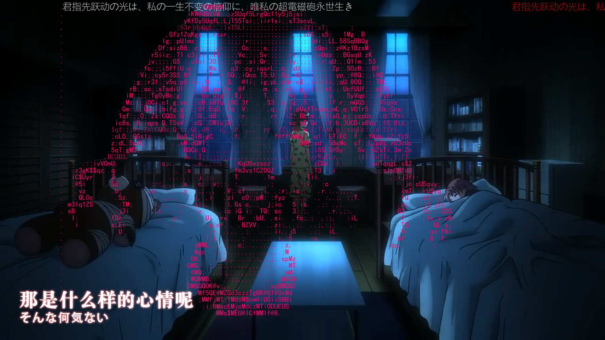
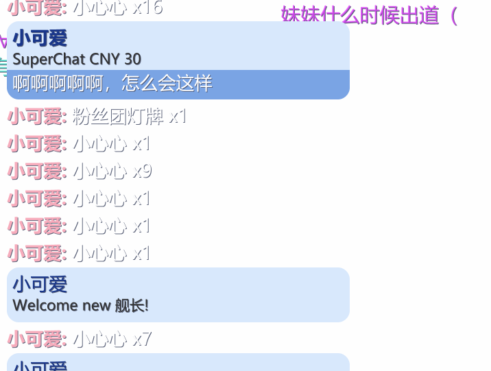
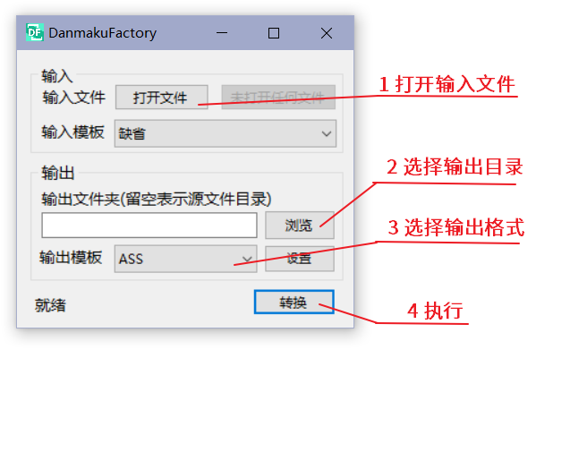
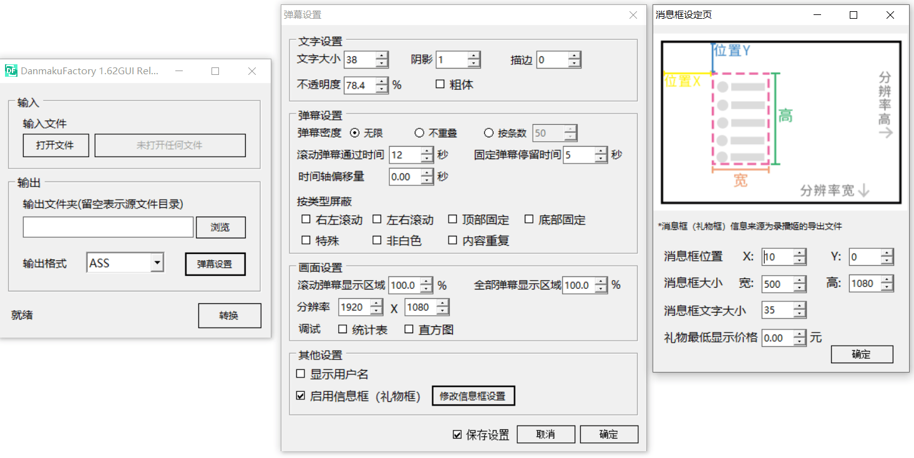

# DanmukuFactory

[](https://github.com/hihkm/DanmakuFactory/actions/workflows/build-release.yml)

DanmakuFactory 是一款弹幕文件转换工具，支持弹幕姬的礼物读取，支持特殊弹幕，支持多格式互转，支持自定义输入模板，~~甚至可以原地 tp~~


## 获取

### Windows

[DanmakuFactory_1.63GUI Release(蓝奏云)](https://hihkm.lanzoui.com/b01hjk83e)

[DanmakuFactory_1.70CLI Release(蓝奏云)](https://hihkm.lanzoui.com/b01hgf1xe)

[DanmakuFactory_1.70 Release(GITHUB)](https://github.com/hihkm/DanmakuFactory/releases)

### 开发

需要提前安装 `git`, `xmake`

1. clone 仓库到本地(注意当前目录下不要有相同名字的文件夹)

```shell
git clone --depth=1 https://github.com/hihkm/DanmakuFactory.git
```

2. 切换工作目录

```shell
cd DanmakuFactory
```

3. 编译，可执行文件为 DanmakuFactory

```shell
xmake build -y -v
```

### Python 版本(Developing)

如果想使用 Python 版本，可以参考：[timerring/DanmakuConvert](https://github.com/timerring/DanmakuConvert)

## 文件格式支持情况

| 选项      | 操作 | 普通弹幕支持 | 特殊弹幕支持 |
| --------- | ---- | ------------ | ------------ |
| **.ass**  | 读   | 支持         | 支持         |
|           | 写   | 支持         | 支持         |
| **.xml**  | 读   | 支持         | 支持         |
|           | 写   | 支持         | 支持         |
| **.json** | 读   | 支持         | **不支持**   |
|           | 写   | 支持         | **不支持**   |

## 特性

1. **1.50 版本支持自定义输入模板，此功能的初衷是让用户能够制作自己的弹幕文件，比如影视工作者想要在自己的视频上加入弹幕的效果，而剪辑软件做出来的弹幕非常地生硬，就可用利用此功能来按照需求快速地设计自己的弹幕文件。**

2. 回炉重造，支持读取经过转换后的 ass 文件，并兼容第三方软件输出的 ass 文件

3. 支持 ass 以注释的形式保存已经被屏蔽的弹幕，下次重新读取时可重新调整设置

4. 支持特殊弹幕！支持特殊弹幕！支持特殊弹幕！

   

   _完美支持 b 站的特殊弹幕，如图为 av810872 的效果_

5. 支持录播姬导出弹幕中的礼物、SC、用户名显示等直播内容

   

6. 强大的统计模式

   

   _在调试模式中，你可以看到屏幕中各类型弹幕的数量，总共屏蔽掉了的数量，没有被屏蔽的弹幕数量以及总弹幕数量，当然还有一个弹幕分布图_

## 其他特性

- 支持各类型弹幕互转
- 支持多个弹幕文件合并
- 支持弹幕文字大小、字体、透明度、阴影、描边的调节
- 支持弹幕时间轴整体偏移、屏幕底部防挡留白、支持按屏幕比例调整弹幕密度
- 支持按类型屏蔽、同屏重复弹幕屏蔽
- 支持控制同屏弹幕的密度，也可以直接让弹幕不重叠
- 支持特殊弹幕的转换
- 统计模式，显示统计弹幕数量表格以及弹幕分布直方图
- 纯 C 代码，完全使用标准库，强大的可移植性

## 命令行展示

\*具体调用方法请参考打包内文档



## 图形界面展示

图形界面部分用的是 VB.NET 编写


