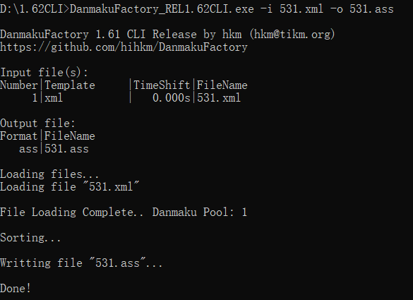

## DanmukuFactory

DanmakuFactory是一款弹幕文件转换工具，支持弹幕姬的礼物读取，支持特殊弹幕，支持多格式互转，支持自定义输入模板，~~甚至可以原地tp~~


#### 获取

##### Windows

[DanmakuFactory_1.63GUI  Release(蓝奏云)](https://hihkm.lanzoui.com/b01hjk83e)

[DanmakuFactory_1.70CLI  Release(蓝奏云)](https://hihkm.lanzoui.com/b01hgf1xe)

[DanmakuFactory_1.70  Release(GITHUB)](https://github.com/hihkm/DanmakuFactory/releases)


##### Linux

需要提前安装git, make, gcc, cmake

1. clone仓库到本地(注意当前目录下不要有相同名字的文件夹)

```shell
git clone git@github.com:hihkm/DanmakuFactory.git
```

2. 切换工作目录

```shell
cd DanmakuFactory
```

3. 递归下载子模块

```shell
git submodule update --init --recursive
```

4. 编译，可执行文件为DanmakuFactory

```shell
cmake -S . -B build
cmake --build build
```


##### macOS

>⚠️ 由于 Xcode 的 External Build System 不好用，这里的工程文件用的是 Command Line Tool 的模板，没有用到 makefile。
>仅供调试，实际使用请参考 Linux。

打开 macOS/ 下的 DanmakuFactory.xcodeproj。

##### Python 版本(Developing)

如果想使用 Python 版本，可以参考：[DanmakuConvert](https://github.com/timerring/DanmakuConvert)

#### 文件格式支持情况

| 选项      | 操作 | 普通弹幕支持 | 特殊弹幕支持 |
| --------- | ---- | ------------ | ------------ |
| **.ass**  | 读   | 支持         | 支持         |
|           | 写   | 支持         | 支持         |
| **.xml**  | 读   | 支持         | 支持         |
|           | 写   | 支持         | 支持         |
| **.json** | 读   | 支持         | **不支持**   |
|           | 写   | 支持         | **不支持**   |


#### 特性

1. **1.50版本支持自定义输入模板，此功能的初衷是让用户能够制作自己的弹幕文件，比如影视工作者想要在自己的视频上加入弹幕的效果，而剪辑软件做出来的弹幕非常地生硬，就可用利用此功能来按照需求快速地设计自己的弹幕文件。**

2. 回炉重造，支持读取经过转换后的ass文件，并兼容第三方软件输出的ass文件

3. 支持ass以注释的形式保存已经被屏蔽的弹幕，下次重新读取时可重新调整设置

4. 支持特殊弹幕！支持特殊弹幕！支持特殊弹幕！ 
   *完美支持b站的特殊弹幕，如图为av810872的效果*

5. 支持录播姬导出弹幕中的礼物、SC、用户名显示等直播内容

   

6. 强大的统计模式
   
   *在调试模式中，你可以看到屏幕中各类型弹幕的数量，总共屏蔽掉了的数量，没有被屏蔽的弹幕数量以及总弹幕数量，当然还有一个弹幕分布图*


#### 其他特性

- 支持各类型弹幕互转
- 支持多个弹幕文件合并
- 支持弹幕文字大小、字体、透明度、阴影、描边的调节
- 支持弹幕时间轴整体偏移、屏幕底部防挡留白、支持按屏幕比例调整弹幕密度
- 支持按类型屏蔽、同屏重复弹幕屏蔽
- 支持控制同屏弹幕的密度，也可以直接让弹幕不重叠
- 支持特殊弹幕的转换
- 统计模式，显示统计弹幕数量表格以及弹幕分布直方图
- 纯C代码，完全使用标准库，强大的可移植性


#### 命令行展示

*具体调用方法请参考打包内文档



#### 图形界面展示

图形界面部分用的是VB.NET编写


#### 更新日志

##### 1.00
- 原始的一坨可读性爆炸版本

##### 1.10
- 结构调整

##### 1.11
- *跟1.20其实是一个版本，不知怎么的当时就傻掉了╮(╯▽╰)╭
- UI微调
- 逻辑优化

##### 1.30
- 大规模修改UI，改善用户体验（炒鸡麻烦的说）
- 解决编码问题，支持ANSI与UTF-8，解决输入中文字体乱码问题
- 增加批量转换
- 增加命令行调用
- 将配置文件存储为文本形式，并支持对旧二进制配置文件的转换

##### 1.31

- 修复了一些BUG

##### 1.40

- 增加了ass弹幕读入功能，并兼容第三方软件生成的ass弹幕文件
- 增加了xml弹幕写出功能
- 增加了json弹幕读入功能（实验）
- 增加了json弹幕写出功能（实验）
- 增加了写出ass文件时屏蔽弹幕以注释方式保留
- 增加了xml弹幕转义符解析
- 增加了多文件弹幕合并
- 修复了特殊弹幕不换行的问题
- 修复了特殊弹幕解析有概率崩溃的问题
- 修复了普通弹幕过长可能导致的崩溃问题

- 优化了部分模块，执行效率有所提高
- 改用json文件存储配置信息，便于修改查看

- 去除了原本不稳定的编码转换模块（后续可能会使用第三方库）

##### 1.41

- 适配linux
- 修复了部分xml特殊弹幕无法正常解析的问题
- 修复了ass输出后空格失效的问题
- 优化排序，对于原本正序的输入无需重新排序

**1.42**

- 修复了部分xml特殊弹幕无法正常解析的问题
- 修复了部分xml特殊弹幕回车或空格显示错误问题
- 取消了特殊弹幕等比缩放

**1.43**

- 增加了GUI版本
- 修复了显示范围无法定义的问题
- 修复了按类型屏蔽设置无法保存的问题

**1.50**

- 增加了文字加粗选项

- 增加了用户自定义输入模板功能（CLI）

- 修复了某些错误发生时程序仍继续执行的问题

**1.51**

- 修复了因发送者id缺失导致xml弹幕在某些播放器上的显示问题

**1.52**

- 修复了小概率无输出文件无报错的问题
- 修复了GUI版本配置文件名错误的问题
- 修复了GUI版本非工作目录运行时找不到依赖程序的问题

**1.60**

- 增加消息框，支持录播姬导出弹幕的礼物、SC弹幕的滚动显示

- 增加发送者ID显示，仅支持录播姬导出的弹幕

- 优化了xml文件读取逻辑

- 优化了部分显示

- 修复了与ass文件互转时部分字符会出现异常的问题

**1.61**

- 新增按礼物最低价格屏蔽

- 修复了配置文件读取目录异常的问题

- 修复了GUI版本非工作目录运行时找不到依赖程序的问题

**1.62**

- 修复了部分文件转换会出现乱码的问题

**1.63**

- 修复了转换的xml文件在弹弹play上无法正常识别的问题
- 修复了一处内存非法访问造成的崩溃问题

##### 1.70

- 新增更精细的下划线和阴影支持
- 新增同一用户相同礼物合并
- 新增sc读取、礼物显示时长设置
- 调整礼物框样式
- 修复了一系列的bug
